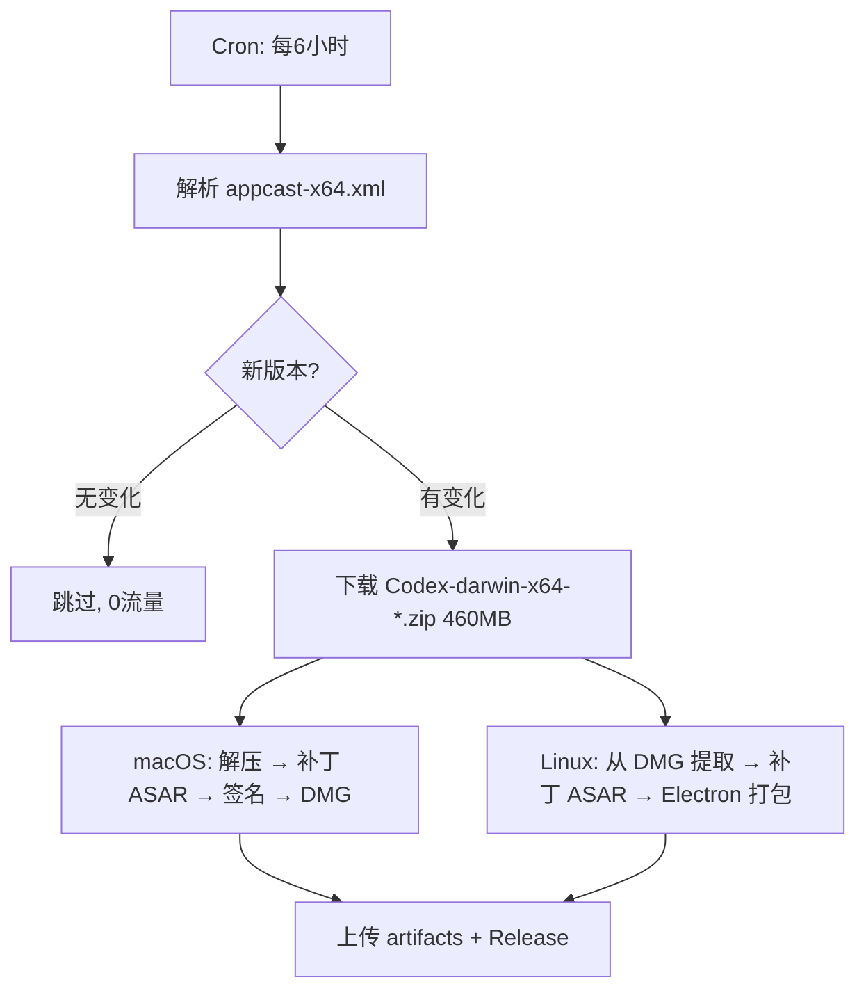

# Codex Dmg Transform — Agent Guide

## Project Overview

This project downloads the official **Codex.app** (OpenAI's desktop Electron application) for Intel Mac (x86_64) from OpenAI's CDN, patches the ASAR to fix i18n/DevTools/updater issues, re-signs it, and creates a distributable `.dmg`. It also builds Linux packages from the same source.

**Original source**: `appcast-x64.xml` → official `Codex-darwin-x64-{version}.zip`

## Project Structure

```
/
├── AGENTS.md                    # This file
├── Design.md                    # Architecture & design document
├── scripts/
│   ├── common.sh                # Shared functions
│   ├── pack-macos-x64.sh        # Download → patch → sign → DMG
│   ├── pack-linux-amd64.sh      # Build Linux amd64 package
│   ├── pack-linux-arm64.sh      # Build Linux arm64 package
│   ├── patches/
│   │   ├── patch-i18n.sh        # Force-enable i18n (中文)
│   │   ├── patch-copyright.sh   # Update copyright text
│   │   ├── patch-devtools.sh    # Enable DevTools
│   │   ├── patch-updater.sh     # Disable auto-updater
│   │   └── patch-sunset.sh      # Disable appSunset gate
│   ├── patch-all.sh             # Run all patches in sequence
│   ├── patch-util.sh            # Shared patch utilities
│   ├── rebuild-native-modules.sh# Native module handling (Linux)
│   ├── extract.sh               # Extract Codex.app from DMG (Linux)
│   ├── download-runtime.sh      # Download Electron/Node.js (Linux)
│   └── info.sh                  # Print app info
├── .github/workflows/
│   └── download-and-patch.yml   # Auto-detect + build + release
├── packages/
│   ├── macos-x64/               # macOS Intel output
│   ├── linux-amd64/             # Linux amd64 output
│   └── linux-arm64/             # Linux arm64 output
```

## CI/CD (GitHub Actions)

**Workflow**: `.github/workflows/download-and-patch.yml`

### 自动模式（定时检测）

| 触发方式 | 说明 |
|---|---|
| `cron: '0 */6 * * *'` | 每 6 小时自动检查 appcast-x64.xml |
| 版本对比 | 通过 `.codex-x64-version` 缓存文件比较，无变化不下载（0 流量） |
| 检测到新版本 | 自动下载 → 补丁 → 构建 → 创建 GitHub Release |



### 手动模式（workflow_dispatch）

在 [Actions 页面](https://github.com/scpuny/Codex-Dmg-Trasnform/actions/workflows/download-and-patch.yml) 点击 **Run workflow**：

| 参数 | 说明 |
|---|---|
| `force` (boolean) | 勾选 = 忽略版本缓存，强制重新下载 |
| `version` (string) | 指定版本号（如 `26.616.32156`），留空 = 最新版 |

```bash
# 示例：手动指定旧版本构建
# 在 GitHub UI 中: version = "26.616.31447"
```

### Version Detection

The workflow parses `appcast-x64.xml` (OpenAI's Sparkle appcast) to get the latest version URL:

## Patches

All patches modify the extracted `_asar/` content before repacking `app.asar`:

| Patch | What it does | Target Files |
|-------|-------------|-------------|
| `patch-i18n.sh` | Replace `X.get("enable_i18n", ...)` → `!0` | `webview/assets/*.js` |
| `patch-copyright.sh` | Update copyright string | `.vite/build/main-*.js` |
| `patch-devtools.sh` | Force-enable InspectElement/DevTools | `.vite/build/main-*.js` |
| `patch-updater.sh` | Return `!1` from updater methods | `.vite/build/*.js` |
| `patch-sunset.sh` | Return `!1` from sunset gate calls | `webview/assets/index-*.js` |

## macOS x64 Build

### Key Difference from ARM64

- Official x64 zip uses **Codex Framework.framework** with `electron_common_owl_features` native binding
- This is a **native Electron framework** (not the standard open-source Electron), so we **keep the original framework**
- We only patch the `app.asar` (frontend bundle) and re-sign

### Manual Build

```bash
./scripts/pack-macos-x64.sh                  # Download latest + patch + DMG
./scripts/pack-macos-x64.sh --check          # Preflight only
./scripts/pack-macos-x64.sh --version 26.616.32156  # Specific version
```

## Linux Build

Linux builds use:
1. **Codex.dmg** (ARM64) extracted on Linux using `apfs-fuse`
2. **Standard Electron** (35.1.0) for the runtime shell
3. **app.asar** from Codex (platform-agnostic, same patches applied)
4. Native modules rebuilt via `rebuild-native-modules.sh`

### Missing Components

Linux builds currently lack:
- `codex` / `codex_chronicle` backend binaries (need cross-compilation from source)
- `cua_node` Node.js runtime is provided but backend may not function without the `codex` binary

## Native Module Rebuild

```bash
./scripts/rebuild-native-modules.sh --app <dir> --platform <os> --arch <arch>
```

| Module | Strategy | Details |
|---|---|---|
| `node-pty` | `prebuilt` | From npm pack (N-API) |
| `better-sqlite3` | `prebuilt` | Electron ABI 133 download |
| `@serialport/bindings-cpp` | `prebuilt` | Reuse cross-platform prebuilds |
| `classic-level` | `prebuilt` | Reuse cross-platform prebuilds |
| `node-hid` | `limited-pb` | Only darwin-arm64 prebuild |
| `node-mac-permissions` | `mac-only` | macOS-only |
| `objc-js` | `mac-only` | macOS-only |
| `@worklouder` | `prebuilt` | Nested native deps only |

## Coding Conventions

- **Shell scripts**: Bash 3.2+ compatible (macOS default), `set -euo pipefail`
- **Line endings**: LF for shell scripts
- **Error handling**: Check exit codes, meaningful error messages
- **Patches**: Python3 for complex regex, sed for simple replacements
- **Documentation**: Keep AGENTS.md in sync with code changes
