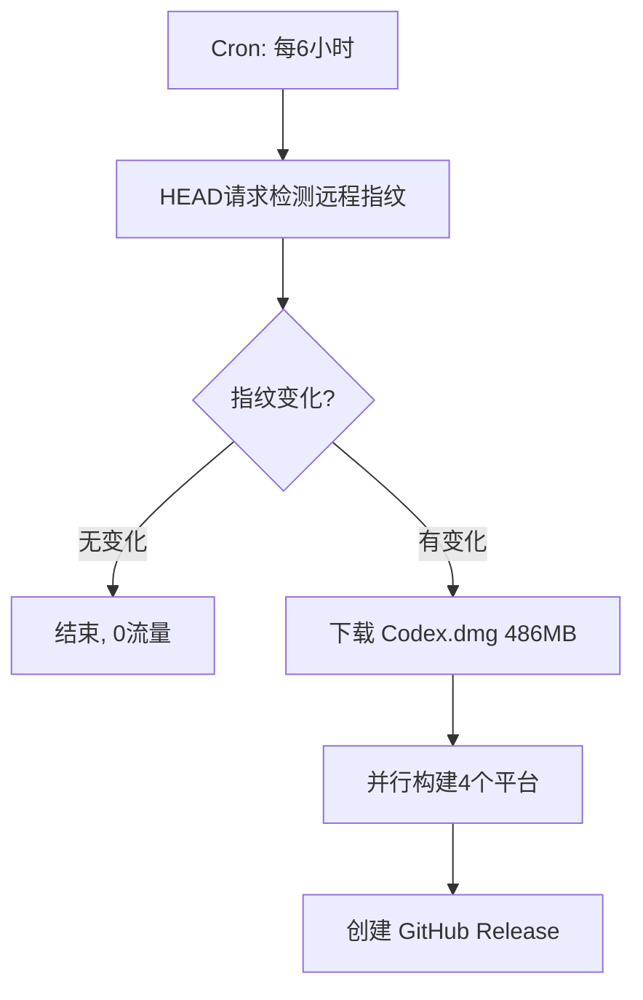

# Codex Dmg Transform — Agent Guide

## Project Overview

This project disassembles and repackages **Codex.app** (OpenAI's desktop Electron application) from the original `Codex.dmg` (macOS ARM64) into cross-platform distributable packages.

**Original source**: `Codex.dmg` — a macOS disk image containing `Codex.app` (version 26.611.62324, Electron/Chromium 149).

## Project Structure

```
/
├── Codex.dmg                    # Original macOS disk image (read-only source)
├── AGENTS.md                    # This file
├── Design.md                    # Architecture & design document
├── scripts/
│   ├── extract.sh               # Extract app from Codex.dmg
│   ├── info.sh                  # Print version/platform info
│   ├── pack-macos-x64.sh        # Build macOS Intel package
│   ├── pack-linux-amd64.sh      # Build Linux amd64 package
│   ├── pack-linux-arm64.sh      # Build Linux arm64 package
│   ├── pack-windows.sh          # Build Windows package
│   ├── rebuild-native-modules.sh# Rebuild native Node modules per platform
│   └── download-runtime.sh      # Download platform-specific runtimes
├── packages/                    # Build output per platform
│   ├── macos-x64/
│   ├── linux-amd64/
│   ├── linux-arm64/
│   └── windows/
├── .github/workflows/
│   ├── build-macos-x64.yml
│   ├── build-linux-amd64.yml
│   ├── build-linux-arm64.yml
│   ├── build-windows.yml
│   └── release-all.yml          # Aggregate release workflow
```

## Key Architectural Components

| Component | Description | Cross-Platform Strategy |
|---|---|---|
| `Codex.app` (Electron shell) | Electron app wrapper (Chromium 149-based) | Rebuild with per-platform Electron binary |
| `Resources/app.asar` | Electron frontend bundle (153 MB) | Platform-agnostic (same asar for all) |
| `Resources/codex` | AI backend binary (236 MB, Go/Rust) | Cross-compile per platform |
| `Resources/codex_chronicle` | Chronicle service binary (4.5 MB) | Cross-compile per platform |
| `Resources/cua_node/` | Custom Node.js runtime (Node 24.14) | Download per-platform Node.js build |
| `Frameworks/Sparkle.framework` | Auto-update framework (macOS only) | Replace with platform updater (Squirrel/Nsis) |

## Coding Conventions

- **Shell scripts**: Bash 5+, use `set -euo pipefail`, prefer `$()` over backticks
- **Line endings**: LF for shell scripts, CRLF only for Windows `.ps1`/`.bat`
- **Error handling**: Always check exit codes, provide meaningful error messages
- **Documentation**: Keep Design.md and AGENTS.md in sync with code changes
- **Testing**: Test each packaging script on the target platform CI runner

## CI/CD

- All packaging runs via **GitHub Actions**
- Matrix builds across:
  - `macos-13` (macOS Intel x64)
  - `macos-14` (macOS ARM64, large runner)
  - `ubuntu-22.04` (Linux x64)
  - `ubuntu-22.04-arm` (Linux ARM64)
  - `windows-2022` (Windows x64)
- Release artifacts uploaded as `.dmg` (macOS), `.deb`/`.AppImage` (Linux), `.exe`/`.msi` (Windows)

## Important Notes

- The original `Codex.dmg` is ~486 MB compressed, ~1.9 GB expanded
- `app.asar` is platform-agnostic — no modification needed for cross-platform
- Native Node modules (`node-pty`, `better-sqlite3`, `objc-js`, `node-mac-permissions`) must be rebuilt per platform
- `codex` binary needs to be cross-compiled from source (Go/Rust) — download prebuilt if available
- `cua_node` runtime needs per-platform Node.js builds
- Sparkle framework is macOS-only; use electron-updater or Squirrel for other platforms

## Auto-Download & Version Detection

**Codex.dmg** is automatically downloaded from OpenAI's official CDN during CI builds:

```
URL: https://persistent.oaistatic.com/codex-app-prod/Codex.dmg
```

### Version Detection（无需下载 DMG）

仅用 **HTTP HEAD 请求**（几百字节流量）检测远程文件是否更新：

```bash
# 获取下载地址
./scripts/check-version.sh --url

# 获取远程文件指纹（HEAD 请求，不下载文件体）
./scripts/check-version.sh --remote
# → Wed, 17 Jun 2026 14:52:47 GMT:486144300

# 对比远程 vs 本地缓存（exit 0=相同, 1=有新版本）
./scripts/check-version.sh --check

# 从已提取的 Codex.app 读取版本号
./scripts/check-version.sh --app build/extracted/Codex.app
# → 26.611.62324 (build 4028)
```

### 自动构建流程（GitHub Actions）

工作流 `auto-detect-and-build.yml` 每 6 小时运行一次：



**对于 `workflow_dispatch` 手动触发**：支持 `force` 参数跳过缓存强制构建。

### Manual Build

```bash
# Download + extract in one step
./scripts/extract.sh --download

# Or specify extraction only from existing DMG
./scripts/extract.sh --dmg Codex.dmg
```

### 前置检查（打包前验证完整性）

**`./scripts/pack-linux-amd64.sh --check`** 会在打包前检查所有必需文件：

```
❌ 发现 N 个错误，请修复后重试
```

| 检查项 | 必需 | 说明 |
|--------|------|------|
| `Codex.app` | ✅ | 从 DMG 提取 |
| `app.asar` | ✅ | Electron 前端 |
| Electron 运行时 | ✅ | 从 GitHub Releases 下载 |
| Node.js 24.14 | ✅ | 从 nodejs.org 下载 |
| `codex` 后端 | ⚠️ | 可选，无此文件 UI 可启动但后端不可用 |
| `codex_chronicle` | ⚠️ | 可选 |
| 应用图标 | ✅ | 从原始 app 提取 |

### 修复缺失文件

```bash
# 下载 Electron + Node.js（在 CI 环境可正常工作）
./scripts/download-runtime.sh --platform linux --arch x64

# 手动下载 Electron 放到指定位置
curl -fSL https://github.com/electron/electron/releases/download/v35.1.0/electron-v35.1.0-linux-x64.zip \\
  -o packages/linux-amd64/electron-35.1.0-linux-x64.zip
```

### 完整打包流程

```bash
# 1. 下载并提取
./scripts/extract.sh --download

# 2. 下载运行时
./scripts/download-runtime.sh --platform linux --arch x64

# 3. 前置检查
./scripts/pack-linux-amd64.sh --check

# 4. 确定无误后打包
./scripts/pack-linux-amd64.sh
```
